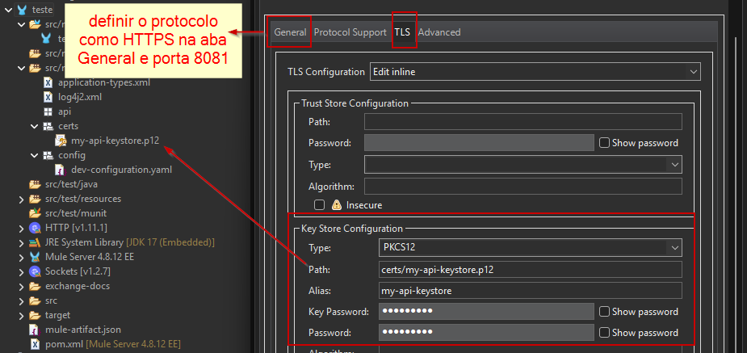
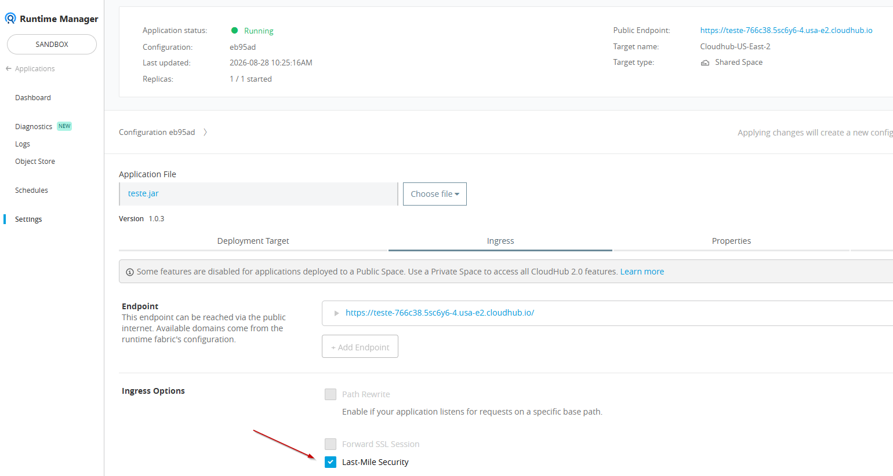

# Criptografia aplicada ao MuleSoft

Fundamentos, certificados, TLS e Cryptography Module.

## 1. Fundamentos de criptografia

Criptografia transforma dados legíveis (texto claro) em dados cifrados. Somente quem possui a chave adequada deve conseguir recuperar o conteúdo original. Entre as técnicas históricas e modernas, destacam-se:

**Substituição:** troca cada símbolo do texto original por outro segundo uma regra. A cifra de César é um exemplo clássico.

**Transposição:** mantém os símbolos, mas altera suas posições segundo uma regra.

**Esteganografia:** oculta a própria existência da mensagem, por exemplo, ao incorporar dados em imagens, áudio ou vídeo. Ela não substitui a criptografia: as duas técnicas podem ser combinadas. Para um observador, o arquivo pode parecer comum, embora carregue dados ocultos.

**Cifras de produto:** realizam rodadas sucessivas e combinadas de substituição e transposição. O algoritmo AES faz isso de forma complexa no nível dos bits.

### 1.1 Hash e criptografia: diferenças fundamentais

| Característica   | Criptografia                                     | Hash                                               |
| ---------------- | ------------------------------------------------ | -------------------------------------------------- |
| Reversível?      | Sim — quem tem a chave certa recupera o original | Não — é uma função unidirecional                   |
| Objetivo         | Confidencialidade                                | Integridade e verificação                          |
| Tamanho da saída | Varia conforme a entrada                         | Fixo; SHA-256 sempre gera 256 bits                 |
| Usa chave?       | Sim, simétrica ou assimétrica                    | Não; senhas podem usar _salt_, que não é uma chave |
| Exemplo          | Cifrar um arquivo                                | Armazenar senhas ou verificar arquivos             |

Regra prática: se você precisa recuperar o dado original, use criptografia. Se precisa apenas verificar que o dado não mudou ou comparar sem armazenar o original, como uma senha, use hash.

Hash não é uma forma de criptografia fraca. Um hash não é "descriptografado"; um atacante pode tentar descobrir a entrada por força bruta ou tabelas previamente calculadas (_rainbow tables_).

### 1.2 Algoritmos de hash

- **MD5:** produz 128 bits e possui colisões práticas. Não deve ser usado em controles de segurança; pode aparecer apenas como checksum não adversarial.
- **SHA-1:** produz 160 bits e possui colisões práticas. Deve ser evitado em novos projetos.
- **SHA-2:** família que inclui SHA-256 e SHA-512, amplamente utilizada em integridade e assinaturas digitais.
- **SHA-3:** possui uma estrutura interna diferente (Keccak) e é uma alternativa ao SHA-2.

Para senhas, hash puro, mesmo SHA-256, não é recomendado porque é rápido demais e permite força bruta em escala. Por isso existem funções deliberadamente lentas:

- bcrypt;
- scrypt;
- Argon2id, configurado com parâmetros adequados ao ambiente.

### 1.3 Criptografia simétrica

A mesma chave cifra e decifra. É rápida e adequada para grandes volumes. O desafio é compartilhar a chave secreta com segurança.

- **AES:** padrão amplamente adotado, com chaves de 128, 192 ou 256 bits. Deve ser usado em modo autenticado, como GCM, sempre que possível.
- **DES:** algoritmo antigo, com chave de 56 bits, atualmente inseguro.
- **3DES:** aplica DES três vezes. É mais seguro que DES, mas lento e em descontinuação.
- **Blowfish e Twofish:** alternativas ao AES, menos utilizadas atualmente.

### 1.4 Criptografia assimétrica

Usa um par de chaves relacionado: uma pública, que pode ser compartilhada, e uma privada, que deve permanecer secreta. Em geral, é usada para estabelecer chaves, cifrar valores pequenos ou criar assinaturas digitais. Dados volumosos são protegidos com criptografia híbrida.

- **RSA:** baseado na dificuldade de fatorar números grandes. Usado em TLS, PGP e assinaturas digitais.
- **ECC:** oferece segurança com chaves menores e eficientes. É usado, por exemplo, em chaves SSH modernas.
- **Diffie-Hellman (DH/ECDH):** permite que duas partes estabeleçam um segredo compartilhado por um canal inseguro.
- **DSA/ECDSA:** usados para assinatura digital, não para cifrar.

No HTTPS moderno, mecanismos de chave pública autenticam as partes e ajudam a estabelecer segredos de sessão. O tráfego usa criptografia simétrica autenticada.

## 2. Certificados digitais

Um certificado digital vincula uma chave pública a uma identidade, como uma pessoa, empresa ou servidor. Ele é assinado por uma autoridade certificadora (CA) ou, no caso de PGP, pode participar de uma rede de confiança (_web of trust_). Contém:

- chave pública do titular;
- informações de identidade;
- período de validade;
- assinatura do emissor.

O certificado não contém a chave privada. Ela é armazenada separadamente e normalmente protegida por senha.

### 2.1 Formatos de certificados e chaves

#### Codificações

A codificação define **como os mesmos dados criptográficos são representados**
no arquivo. Ela não altera a chave ou o certificado nem aumenta sua segurança.
Por exemplo, um certificado X.509 pode ser representado como texto Base64 em PEM
ou como bytes binários em DER.

| Formato | Características                                                                                           |
| ------- | --------------------------------------------------------------------------------------------------------- |
| PEM     | Texto Base64 com cabeçalhos como `-----BEGIN CERTIFICATE-----`. Extensões `.pem`, `.crt`, `.cer` e `.key` |
| DER     | Representação binária. Extensões `.der` e `.cer`                                                          |

PEM e DER podem representar a mesma informação; muda apenas a forma como ela é
codificada em texto ou binário. A ferramenta que consumir o certificado precisa
suportar a codificação escolhida.

#### Contêineres

Um contêiner define **quais objetos criptográficos ficam agrupados no arquivo**.
Dependendo do formato, ele pode guardar um certificado, uma chave privada, uma
cadeia de certificados ou várias entradas. Alguns contêineres, como PKCS#12 e JKS,
também podem ser protegidos por senha.

| Formato                      | O que armazena                                            | Uso típico                             |
| ---------------------------- | --------------------------------------------------------- | -------------------------------------- |
| CRT/CER                      | Certificado público; às vezes, uma cadeia                 | Distribuição para validação            |
| KEY                          | Chave privada                                             | Permanecer no servidor                 |
| PKCS#12/PFX (`.p12`, `.pfx`) | Certificado, chave privada e cadeia, protegidos por senha | Importação e exportação entre sistemas |
| JKS (`.jks`)                 | Contêiner Java para certificados e chaves                 | Aplicações JVM, incluindo Mule         |
| PKCS#7 (`.p7b`, `.p7c`)      | Certificados ou cadeia, sem chave privada                 | Distribuição da cadeia                 |

No mundo Mule/Java, JKS e PKCS#12 são comuns porque o Mule Runtime executa na JVM.

### 2.2 Keystore e truststore no Mule

A distinção é conceitual, não de formato; ambos podem usar `.jks` ou `.p12`:

- **Keystore:** armazena suas chaves privadas e certificados. É usado para provar sua identidade.
- **Truststore:** armazena certificados públicos de entidades confiáveis, como CAs e parceiros.

### 2.3 Keystore e truststore no handshake TLS

**Servidor (keystore):**

- armazena seu certificado e sua chave privada;
- envia o certificado público ao cliente;
- usa a chave privada para provar que é titular do certificado.

**Cliente (truststore):**

- armazena certificados confiáveis;
- verifica se o certificado recebido foi assinado por uma CA confiável ou por uma cadeia que termine nela;
- estabelece a conexão quando a validação é aprovada.

> Esse é o TLS unilateral. No mTLS, o cliente também possui keystore e o servidor possui truststore. As duas partes se autenticam, algo comum em integrações API-to-API no Mule.

No contexto do Mule, operações KBE e XML normalmente usam certificados X.509 em JKS, PKCS#12, PEM ou DER. PGP usa keyrings PGP, não certificados X.509.

### 2.4 Certificados autoassinados com keytool

`keytool` é uma ferramenta de linha de comando distribuída com o JDK. Ela permite
gerar pares de chaves, criar certificados, importar e exportar certificados e
administrar keystores. É especialmente útil no ecossistema MuleSoft porque o Mule
Runtime executa sobre a JVM e utiliza formatos de keystore compatíveis com Java.

Pré-requisito: Java instalado, `JAVA_HOME` configurado e `keytool` acessível no `PATH`.

> Certificados autoassinados são adequados para testes e ambientes controlados. Em endpoints públicos de produção, prefira certificados emitidos por uma CA confiável.

#### 1. Gerar keystore `.p12`

```shell
keytool -genkeypair -alias my-api-keystore -keyalg RSA -keysize 2048 -validity 365 -keystore my-api-keystore.p12 -storetype PKCS12
```

| Parâmetro           | O que faz                        |
| ------------------- | -------------------------------- |
| `-genkeypair`       | Gera o par de chaves             |
| `-alias`            | Identifica a entrada no keystore |
| `-keyalg RSA`       | Define o algoritmo               |
| `-keysize 2048`     | Define o tamanho da chave        |
| `-validity 365`     | Define a validade em dias        |
| `-keystore`         | Define o arquivo de saída        |
| `-storetype PKCS12` | Define o formato do contêiner    |

Extraia o certificado público:

```shell
keytool -exportcert -alias my-api-keystore -keystore my-api-keystore.p12 -storetype PKCS12 -file my-public-cert.crt
```

#### 2. Gerar keystore `.pfx`

`.pfx` e `.p12` representam o mesmo formato PKCS#12. Somente o nome muda:

```shell
keytool -genkeypair -alias my-api-keystore -keyalg RSA -keysize 2048 -validity 365 -keystore my-api-keystore.pfx -storetype PKCS12
keytool -exportcert -alias my-api-keystore -keystore my-api-keystore.pfx -storetype PKCS12 -file my-public-pfxcert.crt
```

O keystore fica no servidor, protegido por senha, e nunca é compartilhado. O `.crt` extraído vai para o truststore do cliente.

#### 3. Importar o certificado no truststore

```shell
keytool -importcert -alias trusted-demo-api -file my-public-cert.crt -keystore client-truststore.p12 -storetype PKCS12
```

| Parâmetro           | O que faz                          |
| ------------------- | ---------------------------------- |
| `-importcert`       | Importa um certificado             |
| `-alias`            | Identifica a entrada no truststore |
| `-file`             | Indica o certificado público       |
| `-keystore`         | Indica o arquivo de destino        |
| `-storetype PKCS12` | Define o formato                   |

Se o truststore não existir, o `keytool` cria o arquivo e solicita uma senha. Para um certificado autoassinado, também pode pedir confirmação de confiança.

```text
SERVIDOR                                      CLIENTE
--------                                      -------
1. genkeypair → my-api-keystore.p12
   (chave privada + certificado)

2. exportcert → my-public-cert.crt
                                      ──► 3. importcert → client-truststore.p12
```

O servidor possui o keystore com identidade e chave privada; o cliente possui o truststore com o certificado público confiável. Esse conceito é utilizado no HTTP Listener e HTTP Requester do Mule.

## 3. TLS no HTTP Listener do MuleSoft



### 3.1 CloudHub 2.0 e Last-Mile Security

No CloudHub 2.0, o certificado apresentado na borda é independente daquele configurado no HTTP Listener. O fluxo possui duas camadas.

#### Camada externa: borda e ingress

- A URL pública chega primeiro ao Ingress Controller.
- O certificado apresentado é o padrão da MuleSoft para `*.cloudhub.io` ou o certificado do domínio personalizado.
- Nessa camada é estabelecida a primeira conexão TLS.

#### Camada interna: Last-Mile



- O Ingress Controller encaminha a requisição ao container da aplicação Mule.
- Sem Last-Mile Security, esse trecho utiliza HTTP.
- Com Last-Mile Security, o Ingress estabelece uma nova conexão HTTPS interna.
- O certificado do HTTP Listener participa dessa segunda conexão.

Um certificado autoassinado pode ser apropriado nesse trecho quando a confiança é administrada no ambiente. Confirme os requisitos vigentes do Private Space.

**Quando avaliar a não ativação:** prioridade de latência muito baixa, aceitação do modelo de confiança da infraestrutura e dados sem requisitos rígidos de criptografia em trânsito.

**Quando ativar:** requisitos internos, contratuais ou regulatórios, como ambientes sujeitos a PCI DSS, dados sensíveis e arquiteturas _Zero Trust_.

## 4. Módulo de Criptografia do MuleSoft

O [Cryptography Module (Módulo de Criptografia)](https://docs.mulesoft.com/cryptography-module/latest/)
implementa **criptografia no nível da aplicação**. Diferentemente do TLS, que
protege os dados enquanto trafegam pela rede, o módulo permite que o próprio flow
cifre, decifre, assine ou verifique o conteúdo processado pela aplicação.

Por exemplo, um flow pode criptografar um payload antes de salvá-lo em um banco de
dados e decifrá-lo somente quando precisar processá-lo novamente. O mesmo conceito
pode ser aplicado antes de enviar dados para uma fila, arquivo ou sistema externo.
Assim, a informação pode permanecer protegida mesmo depois de sair do canal TLS.

1. **JCE:** oferece PBE, que deriva uma chave de uma senha, e KBE, que usa uma chave criptográfica fornecida.
2. **PGP:** usa chaves pública e privada e é comum na troca segura de arquivos entre parceiros.
3. **Operações XML:** cifram partes de XML e aplicam ou verificam assinaturas digitais XML.

| Estratégia | Origem da chave             | Tipo                     | Uso típico                      |
| ---------- | --------------------------- | ------------------------ | ------------------------------- |
| JCE/PBE    | Senha ou frase secreta      | Simétrica                | Senha compartilhada             |
| JCE/KBE    | Chave fornecida diretamente | Simétrica ou assimétrica | Chaves ou keystores gerenciados |
| PGP        | Par de chaves PGP           | Assimétrica/híbrida      | Troca segura entre parceiros    |
| XML        | Depende da estratégia       | Simétrica ou assimétrica | Cifrar ou assinar partes de XML |

### 4.1 Exemplo com JCE e KBE

> **Atenção:** para tornar o exemplo autocontido e didático, a senha
> `Senha@123` foi mantida diretamente no XML. Em produção, use Secure
> Configuration Properties ou outro mecanismo seguro de gerenciamento de
> segredos. RSA deve proteger dados pequenos ou chaves de sessão. Para payloads
> maiores, use AES-GCM e proteja a chave AES com criptografia assimétrica.

```xml
<?xml version="1.0" encoding="UTF-8"?>

<mule xmlns:crypto="http://www.mulesoft.org/schema/mule/crypto" xmlns:tls="http://www.mulesoft.org/schema/mule/tls"
	xmlns:ee="http://www.mulesoft.org/schema/mule/ee/core"
	xmlns:http="http://www.mulesoft.org/schema/mule/http" xmlns="http://www.mulesoft.org/schema/mule/core" xmlns:doc="http://www.mulesoft.org/schema/mule/documentation" xmlns:xsi="http://www.w3.org/2001/XMLSchema-instance" xsi:schemaLocation="http://www.mulesoft.org/schema/mule/core http://www.mulesoft.org/schema/mule/core/current/mule.xsd
http://www.mulesoft.org/schema/mule/http http://www.mulesoft.org/schema/mule/http/current/mule-http.xsd
http://www.mulesoft.org/schema/mule/ee/core http://www.mulesoft.org/schema/mule/ee/core/current/mule-ee.xsd
http://www.mulesoft.org/schema/mule/tls http://www.mulesoft.org/schema/mule/tls/current/mule-tls.xsd
http://www.mulesoft.org/schema/mule/crypto http://www.mulesoft.org/schema/mule/crypto/current/mule-crypto.xsd">
	<http:listener-config name="HTTP_Listener_config" doc:name="HTTP Listener config" doc:id="33fad091-7d83-4b8e-a40f-811c6cabbe3e" >
		<http:listener-connection host="0.0.0.0" port="${api.port}" protocol="HTTPS">
			<tls:context >
				<tls:key-store type="pkcs12" path="certs/my-api-keystore.p12" alias="my-api-keystore" keyPassword="Senha@123" password="Senha@123" />
			</tls:context>
		</http:listener-connection>
	</http:listener-config>
	<global-property doc:name="Global Property" doc:id="3af19b8a-ec5d-465b-a894-7f5cec71ac0b" name="env" value="dev" />
	<configuration-properties doc:name="Configuration properties" doc:id="4b14a088-78c7-4391-9143-49e3351be5b0" file="config/${env}-configuration.yaml" />
	<crypto:jce-config name="Crypto_Jce" type="PKCS12" doc:name="Crypto Jce" doc:id="bd5dde2a-6afa-4bce-99a9-f47e9840fe92" keystore="certs/my-api-keystore.p12" password="Senha@123" >
		<crypto:jce-key-infos >
			<crypto:jce-asymmetric-key-info keyId="minhaChaveApi" alias="my-api-keystore" password="Senha@123" />
		</crypto:jce-key-infos>
	</crypto:jce-config>
	<flow name="testeFlow" doc:id="e2ffbc66-912c-416d-840b-ff6c6274db90" >
		<http:listener doc:name="Listener" doc:id="ac2c7fea-6048-4d20-9f55-9f5e3d9d6879" config-ref="HTTP_Listener_config" path="/p1"/>
		<ee:transform doc:name="Transform Message" doc:id="ebc7de77-39d1-484b-92ce-93cbf0959545" >
			<ee:message >
				<ee:set-payload ><![CDATA[%dw 2.0
output application/json
---
payload]]></ee:set-payload>
			</ee:message>
		</ee:transform>
		<logger level="INFO" doc:name="Logger" doc:id="9fc9a0b4-c86f-45f3-b574-110f79534ba1" message="#['\n'] #[payload] #['\n']"/>
		<crypto:jce-encrypt doc:name="Jce encrypt" doc:id="bcef53f7-df4c-44ac-a4fc-6df4557200ed" config-ref="Crypto_Jce" algorithm="RSA" keyId="minhaChaveApi"/>
		<ee:transform>
    <ee:message>
        <ee:set-payload><![CDATA[%dw 2.0
output application/json
---
{
    encrypted: payload as String {encoding: "Base64"}
}]]></ee:set-payload>
    </ee:message>
</ee:transform>
		<logger level="INFO" doc:name="Logger" doc:id="e24ffbbb-cae2-4790-8171-d4327013f3df" message="#['\n'] #[payload] #['\n']" />
	</flow>
</mule>
```

## 5. Referências

- [MuleSoft — Cryptography Module Reference](https://docs.mulesoft.com/cryptography-module/latest/cryptography-module-reference)
- [MuleSoft — CloudHub 2.0 Networking Architecture](https://docs.mulesoft.com/cloudhub-2/ch2-networking-guide)
- [MuleSoft — Configuring XML Cryptography](https://docs.mulesoft.com/cryptography-module/2.0/cryptography-module-xml)
